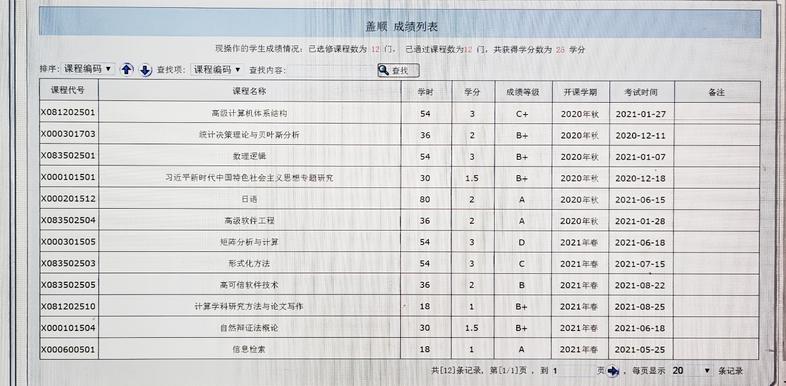
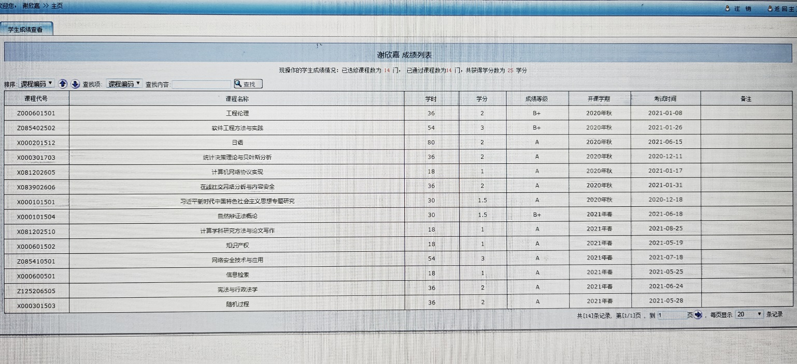
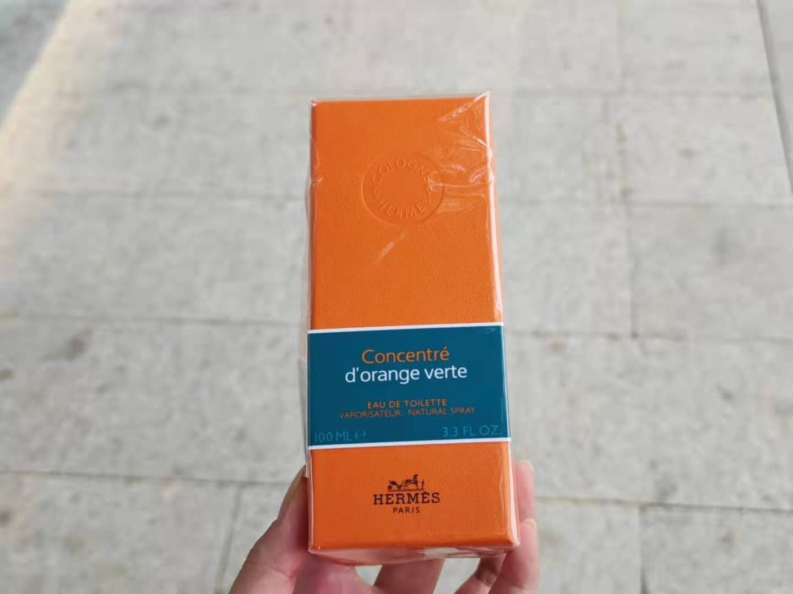
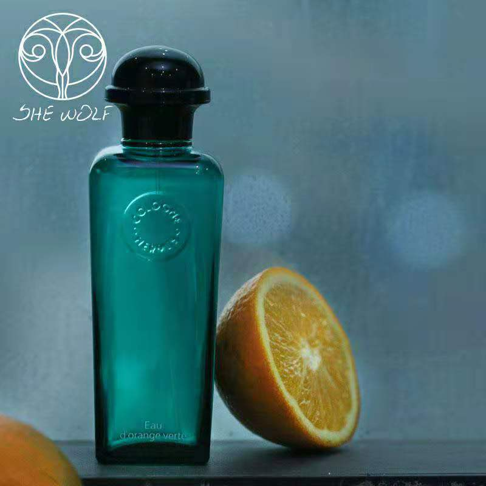

我将永远记得这个夏天，记得翠绿葱苍，记得玫瑰娇艳，记得花枯叶脆，记得你在我怀里的芬芳，记得你在我手掌心的柔软，记得我永远爱你

<!-- more -->

你好漂亮，对你有好感之前，也是我会调侃你"美女加个微信吗？"的好看，在一起之后是我每天忍不住想要吻你的好看。

你超级优秀，优秀到大家都嫉妒你，优秀到大家对你有更高的期望，优秀到大家觉得你的优秀是理所当然的。
复习两个小时考过金融方面的证书，14门课11个A,3个B+，英语六级耳机坏了最后抱憾只考了600多分。

你疯狂地走出舒适圈，技能树点满，书法，茶艺，古琴，电影，文学样样在行。

你眼界开阔，明白自己想要什么，既有抱负又有责任心，思想独立又成熟，别人口里的说辞无法左右你的决定。

### 我们真好勇敢！！！

爱情是我毕生最大的追求，
如果遇不到我要找的人，我愿意孤独一生。

这是你我从未有过的勇敢，
我们真的这么快就可以在一起了。

我明白，年龄越长，想要去了解一个人的成本越高，
不同的经历塑造不同的人，每个人的性格根植于这些经历。
但是
五个小时，
你夺走了我的生命。

现在我们在一起快要五个月了，依然甜蜜如斯。

这瓶橘绿之泉，用来纪念我们这个夏天，这个毕生难忘的夏天。

